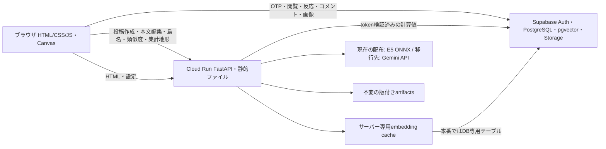
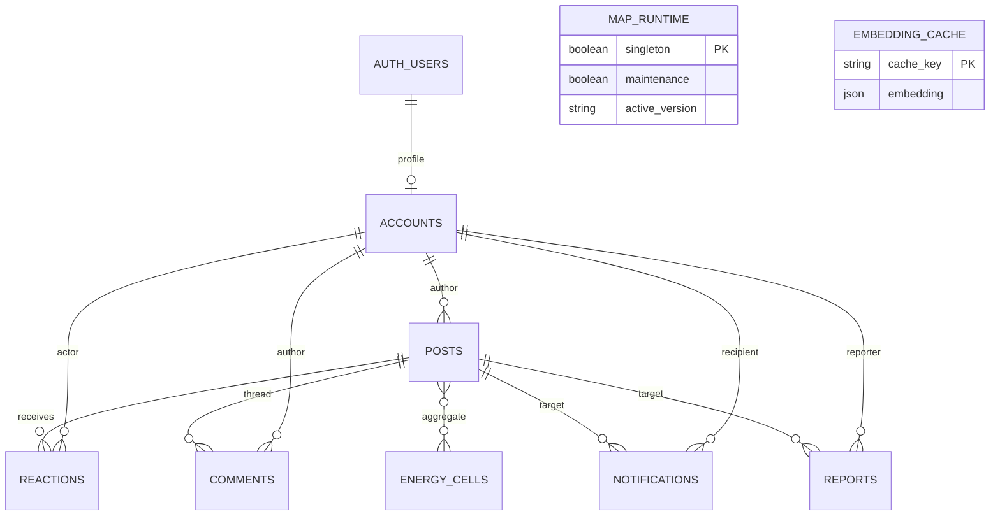

# islands システム構成

2026-09-08追記: 最新の対象・実測結果は [運用手順](operations_runbook.md) を参照。
最新成功デプロイのURLは `https://islands-vfjsyo6oyq-an.a.run.app`。
旧keepalive URLのstore_ok=falseを現行本番の障害と混同しない。
以下のURL・revision等は過去の確認記録として扱う。

確認日: 2026-09-08（JST）。「稼働確認」「リポジトリ設定」「今回追加・未反映」を区別する。

## 確認した環境

| 項目 | 値 | 根拠と確認範囲 |
|---|---|---|
| 公開URL | `https://islands-vfjsyo6oyq-an.a.run.app` | 同日の公開 `/api/health`, `/api/config` 調査 |
| Cloud Run | サービス `islands`、東京 `asia-northeast1` | 2026-09-01成功GitHub Actionsログと `.github/workflows/ci.yml` |
| GCP project | `gen-lang-client-0999045451` | 同成功デプロイログ |
| 最終成功リビジョン | `islands-00006-mej` | 同ログ。最新のCloud Run実リソース再取得は未実施 |
| コミット | `bdfe205991a20ca55c660a3da07aaf3a326e1f30` | デプロイログと改修前ローカルHEADが一致 |
| Artifact Registry | `asia-northeast1-docker.pkg.dev/gen-lang-client-0999045451/cloud-run-source-deploy/islands` | CIのimage組み立て式と成功ログ |
| コンテナ制限 | 2GiB / 1CPU / 最大4インスタンス / 同時12 / timeout120秒 / CPU boost | CIのdeploy引数。現在の実リソース差分は未確認 |
| GitHub → GCP認証 | Workload Identity Federation → deployサービスアカウント | CIの `id-token: write` と `google-github-actions/auth`。WIF識別子・IAM付与の現在値は未確認 |
| Supabase | `https://soznrzkhvktzxlslpphm.supabase.co` | 公開config。サービスキーは非公開 |
| DB接続 / 投稿 | `store=supabase`, `store_ok=true`, 投稿6件 | 同日公開health。時点値であり件数保証ではない |
| マップ | `kotoba-map-v1`、seed1,000、regions10 | 公開healthとローカルseed meta |
| 配布embedding | `intfloat/multilingual-e5-small` / 384次元、特徴量448次元 | 同梱 `artifacts/seed_map.json` meta。旧healthはproviderを返さないため稼働設定そのものは未確定 |
| 監視 | READMEにCloud Monitoring構想、keepalive workflowは手動 | Uptime Check・通知先・予算アラートの実リソースは未確認 |

上記は今回の変更が本番反映された証拠ではない。Gemini APIコードは存在したが、
既存CIのGemini設定は無効で、配布データはE5だった。Geminiで本番が動いているとは断定できない。

## データ経路

`web/js/net.js` がブラウザの経路を分岐する。読み取り・反応・コメントをSupabaseへ
直接送り、embeddingを必要とする投稿作成・本文編集はFastAPIへ送る。
FastAPIは `core/auth.py` でJWTを検証してから、service権限で計算結果を保存する。
公開configに配るのは公開キーだけ。serviceキー、Geminiキー、投稿vecは配信しない。

## DBと権限

ER図のenergy_cellsは論理集計関係。投稿から個別セルへの外部キー関係ではない。
Storageの `post-images` は `image_path` / `avatar_path` から参照する。

| 領域 | 責任 |
|---|---|
| Auth | OTP発行/照合、refresh token。未設定OAuthはUIに出さない |
| accounts | 公開プロフィール。本人更新をRLSで制限。認証メールは別管理 |
| posts | 投稿ID・本文・タグ・画像パス・熱量と、計算したx/y/cluster/vec/vec_c/terms。ブラウザのINSERTを許可しない。ベクトル列に公開SELECT権限を与えない |
| reactions/comments | 本人の操作をRLSで制限。DBトリガーで件数・通知・地形集計を更新 |
| notifications/reports | 本人宛の通知と本人からの報告をRLSで制限 |
| Storage | 公開画像の読み取り、UID先頭のパスへの本人書き込み、最大1MiBと画像MIME |
| map_runtime（追加） | active_versionとmaintenanceを公開読み取り。変更はserviceのみ |
| embedding_cache（追加） | モデル契約+入力のSHA-256でキー化。生本文は保存しない。ベクトルの読み書きはserviceのみ |

正本DB変更は `supabase/migrations/`。`supabase/schema.sql` は初期スキーマの資料であり、
追加マイグレーションを含まない。新規環境は `supabase db reset`、既存環境は適用履歴を
確認してマイグレーションを適用する。初期SQLを再実行する運用には戻さない。

## モデル処理と版の契約

1. Sudachiによる内容語抽出と本文それぞれのembeddingを作る。
2. 384次元の密特徴量と、語/文字TF-IDF・SVD由来64次元の疎特徴量を結合する。
3. ビルド時だけ教師UMAPとエンコーダーを学習し、クラスタ・重心・類似度の校正を保存する。
4. 投稿時は凍結エンコーダーで投影する。他の投稿を追加しても既存座標を再計算しない。
5. 地形は座標と `motivation + 5×反応/コメント数` の円錐の和。島名は実投稿の内容語から付ける。
6. 似てる度は投影前の中心化された448次元の空間で測る。画面上の距離とは一致を保証しない。

今回追加した `artifacts/manifest.json` はprovider、model、次元、task、前処理、
特徴量設定、artifact版、seed/encoder/vectorizersのSHA-256を記録する。
不一致は起動失敗。キーを置いただけでGeminiを選ばず、エラー時にE5へ切り替えない。

Gemini移行先は `gemini-embedding-2` / 384次元 / `sentence similarity`。
本文・内容語を同一batchで送信し、ヘッダーでAPIキーを渡す。429や通信失敗の再試行は
オンラインembedding batchについて45秒以内を目標とする。DB・キャッシュ・投影を含む
リクエスト全体の厳密な45秒保証は未実装で、負荷・遅延試験が必要。
仕様根拠: [Google公式Embeddings](https://ai.google.dev/gemini-api/docs/embeddings)。

## 環境差と可観測性

| 環境 | Store / 認証 | モデル | キャッシュ / runtime |
|---|---|---|---|
| ローカル | MemoryStore、画面にOTP、再起動で投稿消去 | 明示provider、既定onnx | Gemini時SQLite。DB runtimeチェックなし |
| Python / ブラウザCI | MemoryStore、rate limit無効 | E5で現行版の回帰 | 外部Geminiを呼ばない。Gemini失敗はMockTransportで検証 |
| DB CI | SupabaseローカルDocker | embeddingなし | migrationsを適用しpgTAPでRLS/Storage/runtimeを検証 |
| 外観改修本番（予定） | Supabase | E5/v1 | migration適用後 `MAP_RUNTIME_CHECK=1` |
| Gemini本番（未移行） | 同じSupabaseのIDを保持 | Geminiの新artifacts版 | DB永続キャッシュ、runtime必須、旧版APIは503 |

新healthは `embedding`, `artifact_version`, `artifact_compatible`, `active_map_version`,
`maintenance`, `ready` を返す。`ok=true`/HTTP200だけで監視・昇格しない。
configには `map_version` を追加。画面が変更を検知すると再読込の案内を出す。
機密値はhealth/configに出さない。新healthの本番稼働値は未取得。

関連: [外観監査](design_audit.md)、[運用手順](operations_runbook.md)、
[既存API資料と追加契約](api_reference.md)。
